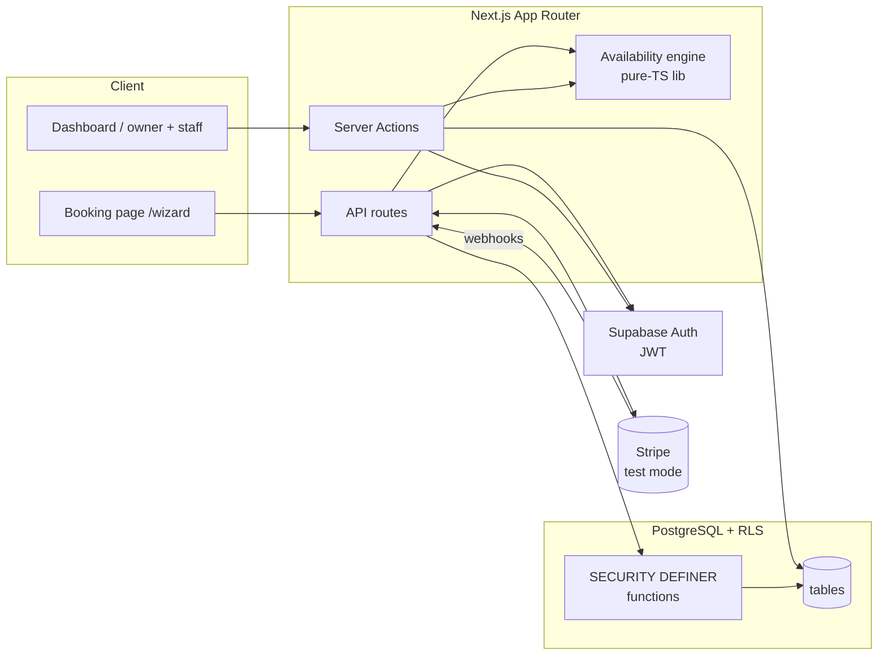

# Slotly


**Live demo:** https://slotly.shekukoroma.com — *deploying soon*

Slotly is the calm, dependable front desk a service business never had. Customers pick a time on a light, fast booking page; owners run the whole operation — staff, services, availability, payments, reminders — from a dark dashboard that treats double-bookings as a database impossibility, not a UI hope. Bookings are held while payment completes, so a customer never pays for a slot someone else just took.

## Stack

- **Next.js 16** App Router (React 19, Turbopack, Cache Components / Partial Prerendering)
- **TypeScript** strict
- **Tailwind CSS 4** (design tokens as CSS vars in `src/app/globals.css`)
- **shadcn/ui** on **Radix** primitives (typed wrappers in `src/components/ui/`)
- **PostgreSQL** with **Row Level Security** — every table RLS-enabled; owners, staff, and the public each see exactly their slice
- **JWT auth** via Supabase Auth (session cookies via `@supabase/ssr`; server actions re-verify the JWT on every call)
- **Stripe** in **test mode only** — `getEnv()` throws on `sk_live_` keys; the Payment Element is dynamically imported so it never weighs down the booking page

## Architecture



- **Availability engine** (`src/lib/availability/`) is a pure-TypeScript library: business hours, staff hours, overrides, blackouts, approved time off, and blocking bookings fold into per-day slot grids. It powers the public slot picker, the dashboard reschedule flow, and the calendar preview from one code path — property-tested with fast-check.
- **PostgreSQL does the hard concurrency work**: `get_availability` and `create_booking` are `SECURITY DEFINER` functions so the public booking flow never touches tables directly; RLS policies scope everything else by JWT (`is_business_member`, `business_role`, `own_staff_id` helpers).
- **Stripe webhooks** are deduplicated in `webhook_events` before any state changes; the reminder cron is idempotent via a partial unique index on `notification_log`.

## The hold-then-pay design

Collecting money for a time slot is a race: two customers can click the same 2:00 PM slot within seconds of each other. Slotly makes double charges impossible **by construction**, in three layers:

1. **`EXCLUDE USING gist`** on `bookings` — no two live bookings (`pending`, `payment_pending`, `confirmed`) for the same staff member may overlap in time. The database rejects the loser of any race with `23P01`; the API maps it to HTTP 409.
2. **Idempotency keys** — bookings carry `idempotency_key`, payments carry `slotly:{booking_id}:{kind}`. Retried requests (double-clicks, webhook redeliveries) resolve to the existing row instead of creating a second charge.
3. **Webhook dedup** — every Stripe event is recorded in `webhook_events` (unique `stripe_event_id`) before processing; replays are no-ops.

The booking flow itself is hold-then-pay: a slot is held (`payment_pending`, 10-minute `hold_expires_at`) while the customer completes the Stripe Payment Element, then confirmed by the webhook. A hold that never pays simply expires back into the grid.

## Getting started

### Prerequisites

- Node 22+, npm
- A Supabase project (PostgreSQL + Auth)
- Stripe test-mode keys, Resend key (email), Twilio (SMS, optional)

### 1. Environment

Copy `.env.example` to `.env.local` and fill in:

| Variable | Where | Notes |
|---|---|---|
| `NEXT_PUBLIC_SUPABASE_URL` | Supabase dashboard | Project URL |
| `NEXT_PUBLIC_SUPABASE_ANON_KEY` | Supabase dashboard | Anon/public key |
| `SUPABASE_SERVICE_ROLE_KEY` | Supabase dashboard | Webhooks + cron only; never ships to the browser |
| `STRIPE_SECRET_KEY` | Stripe dashboard | **Test mode only** — `sk_test_…`; `sk_live_` throws at boot |
| `NEXT_PUBLIC_STRIPE_PUBLISHABLE_KEY` | Stripe dashboard | `pk_test_…` |
| `STRIPE_WEBHOOK_SECRET` | `stripe-cli` | From `stripe listen` (below) |
| `RESEND_API_KEY` | Resend dashboard | Booking confirmations + reminders |
| `TWILIO_ACCOUNT_SID` / `TWILIO_AUTH_TOKEN` / `TWILIO_FROM_NUMBER` | Twilio | SMS reminders only |
| `NEXT_PUBLIC_ENABLE_SMS` | — | `true` to send SMS, `false` to stay email-only |
| `APP_URL` | — | `http://localhost:3000` locally |
| `CRON_SECRET` | you | Bearer token for the reminder cron |

### 2. Database

Apply the migrations in order to your Supabase project (`supabase/migrations/00001` → `00016`), then the seed:

```bash
# with the Supabase CLI linked, or paste each file into the SQL editor in order
supabase db push        # migrations 00001–00016
```

`supabase/seed.sql` creates a demo barbershop ("Harbor & Pine", slug `harbor-and-pine`) with staff, services, hours, and bookings. **Edit the `v_owner` UUID at the top of the file** to a real `auth.users` id first — the seed aborts otherwise.

### 3. Run

```bash
npm install
npm run dev          # http://localhost:3000
```

Forward Stripe webhooks locally while developing:

```bash
stripe-cli listen --forward-to localhost:3000/api/webhooks/stripe
# copy the printed whsec_… into STRIPE_WEBHOOK_SECRET
```

### 4. Verify

```bash
npm run lint        # eslint, zero warnings
npm run typecheck   # tsc --noEmit
npm test            # Vitest — 179 tests across 20 files
npm run build       # production build (Turbopack)
npm run bundle:gate # per-route JS budget: 700 KB raw (see below)
```

CI (`.github/workflows/ci.yml`) runs all five on every push/PR.

### Bundle budget

`npm run bundle:gate` sums the client chunks each route loads and fails any route over **700 KB raw** (`BUNDLE_BUDGET_KB` in `ci.yml`). The booking page targets **≤180 KB gzipped** (~550 KB raw): the Stripe Payment Element is dynamically imported and only loads on the payment step. If a route legitimately outgrows the budget, raise it with a written justification in `ci.yml` — never silently.

## Project map

| Area | Location |
|---|---|
| Public booking flow | `src/app/[slug]/` (page, `book/`, confirmation) |
| Marketing pages | `src/app/(marketing)/` |
| Owner dashboard | `src/app/(dashboard)/dashboard/` (Today, Bookings, Calendar, Services, Staff, Availability, Customers, Settings) |
| Staff portal | `src/app/(dashboard)/dashboard/staff/time-off`, `…/profile` |
| Manage-booking link | `src/app/manage/[token]/` |
| API routes | `src/app/api/` (availability, bookings, payments, webhooks, reminders cron) |
| Availability engine | `src/lib/availability/` |
| Migrations + seed | `supabase/migrations/`, `supabase/seed.sql` |

## Lessons learned

- **Token rotation: "latest link wins."** Invite resends mint a fresh token and overwrite the hash — the old link dies immediately. Simple to reason about, no revocation lists.
- **Closed days are the absence of a row.** There is no `is_open` flag on the business; a weekday with no `availability_rules` row is closed. One fewer boolean to keep in sync, and the engine's `resolveWindow` reads naturally.
- **Step alignment is anchored at opening time.** Slots snap to `slot_step_minutes` measured from the day's open — a judgment call: it keeps grids predictable ("every :00 and :30") at the cost of not packing slots against arbitrary rule starts.
- **`bufferAfter` may spill past close.** A booking's cleanup buffer is allowed to run past closing time; the *bookable* start is what must fit inside hours. Blocking the grid for buffers but not rejecting the booking was the deliberate trade-off.
- **Precedence is explicit: blackout > override > staff > business.** When rules overlap, the order is a documented constant, not an accident of query order — the engine resolves each day through that chain.

## AI workflow note

This project was built by AI agents in scoped waves (scaffold → schema → availability engine → domain libs → public surfaces → dashboard → APIs → integration), each wave verified against its own spec before the next began. Review was not "vibes":

- the availability engine carries **property-based tests** (fast-check) over slot generation, not just example cases;
- repo-wide `tsc --noEmit`, `eslint` (zero warnings), and the full Vitest suite gate every change;
- migrations were reviewed in run order for FK resolution, duplicate constraint/index names, RLS on every table, and seed-column agreement;
- the final integration wave reconciled cross-wave contracts (deduped the business-context modules, closed the staff-portal nav loop, shipped the two missing invite RPCs) and fixed a real build break (route-group pages colliding at `/`).

What AI didn't do: choose the product trade-offs above — those were specified up front and implemented as documented judgment calls.
